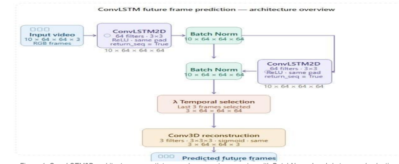
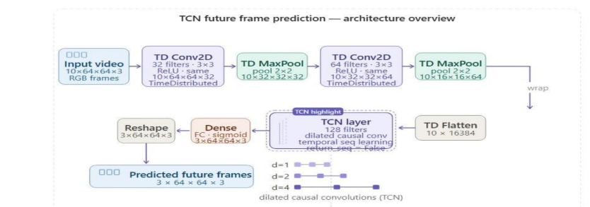

# Future Frame Prediction — ConvLSTM2D vs CNN+TCN

Comparative study of two deep learning architectures for spatiotemporal video prediction on the UCF-101 dataset.

---

## Overview

Given 10 consecutive video frames, the model predicts the next 3 future frames. This task requires simultaneously modelling **spatial content** (what objects look like) and **temporal dynamics** (how they move).

Two architectures are compared:
- **ConvLSTM2D** — unified spatiotemporal recurrent processing
- **CNN + TCN** — separate spatial encoding followed by dilated causal temporal modelling

---

## Dataset

- **UCF-101** (5 classes: BoxingPunchingBag, BoxingSpeedBag, Biking, JumpRope, WalkingWithDog)
- ~500 video clips, sampled at 25 FPS
- Each clip processed into 13 frames resized to 64×64 RGB
- Input: frames 1–10 → Target: frames 11–13
- 80/20 train/validation split

---

## Model Architectures

### ConvLSTM2D
Replaces all matrix multiplications in LSTM with spatial convolutions, maintaining a full 2D hidden-state map at every time step. Spatial context is never destroyed during temporal modelling.

### CNN + TCN
Two-stage approach: a TimeDistributed CNN encoder extracts per-frame spatial features, followed by a TCN with dilated causal convolutions for temporal modelling.

---

## Training Setup

| Parameter | Value |
|---|---|
| Frame resolution | 64×64 px |
| Input / Output sequence | 10 frames → 3 frames |
| Loss function | MSE |
| Optimizer | Adam (lr=0.001) |
| Epochs | 100 |
| Batch size | 4 |

---

## Results

| Model | MSE ↓ | RMSE ↓ | PSNR ↑ | Val Loss ↓ | Generalisation |
|---|---|---|---|---|---|
| ConvLSTM2D | 0.01965 | 0.1402 | 18.45 dB | **~0.034** | ✅ Good |
| CNN + TCN | **0.01660** | **0.1288** | **19.89 dB** | ~0.052 | ❌ Overfit |

### Key Insight

TCN achieves better pixel-level metrics (MSE, PSNR) — but these are computed across both training and validation samples. Because TCN **memorises** training data, its pixel error on seen sequences is artificially low.

The validation loss tells the real story: TCN's val loss stays flat at ~0.052 from epoch 1, while ConvLSTM's drops steadily to ~0.034. **Pixel-level metrics without validation context are insufficient for evaluating generative models.**

ConvLSTM's blurry-but-structured output is more useful than TCN's sharp-but-spatially-distorted predictions. The blurriness is a tractable limitation (addressable with perceptual/adversarial losses); TCN's spatial distortion is an architectural mismatch.

---

## Tech Stack

- Python, TensorFlow, Keras
- UCF-101 dataset (via Kaggle: `pevogam/ucf101`)
- Metrics: MSE, RMSE, PSNR, Validation Loss

---

## Future Work

- Replace MSE with perceptual or adversarial (GAN-based) loss to reduce blurriness
- Train on larger, more diverse video datasets
- Explore attention-augmented architectures: Video Transformers, PredRNN

---

## Course

Deep Learning — DSAI308 | Zewail City of Science and Technology
